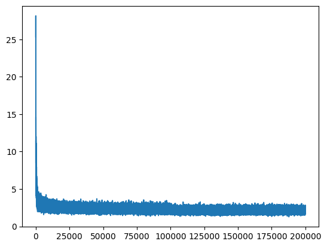
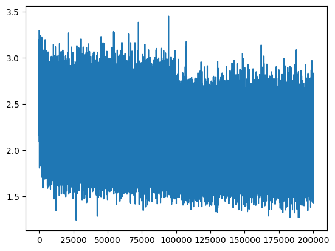
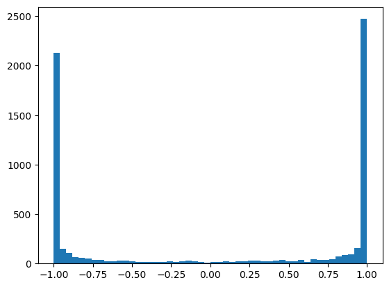
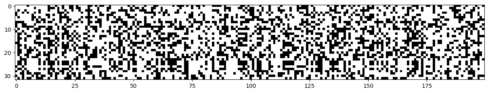
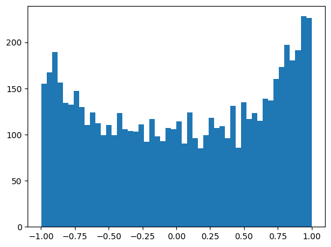
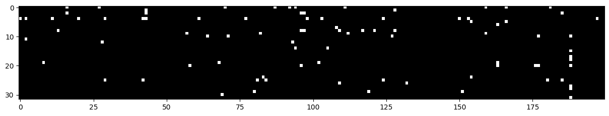
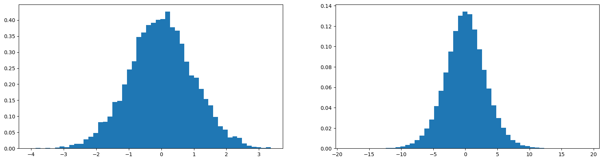
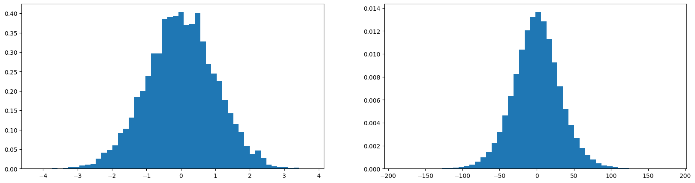
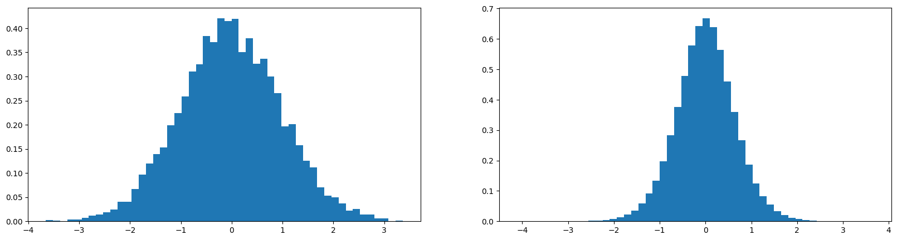
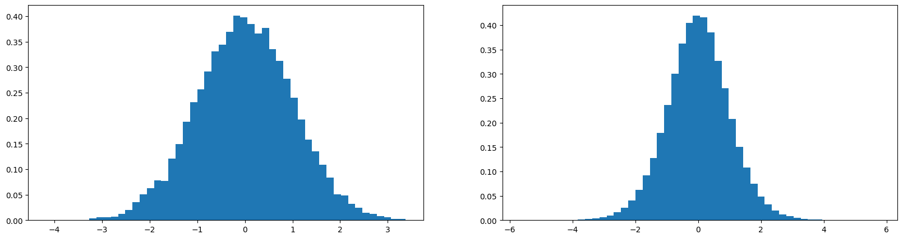

# Activations and Gradients Statistics

> ***"... Really what I want to talk about is the importance of understanding the activations, the gradients and their statistics in neural networks. And this becomes increasingly important, especially as you make your networks bigger, larger and deeper."***
>
> *from Andrej Karpathy*

***Table of Contents***
<!-- no toc -->
- [*Basic MLP*](#basic-mlp)
- [*Initialization*](#initialization)
- [*Activations*](#activations)
- [*Batch Normalization*](#batch-normalization)
- [*Train Deeper*](#train-deeper)

## Basic MLP

First of all, let's rewrite the basic MLP more nicely.

```python
# dataset setup
import torch
import torch.nn.functional as F
import matplotlib.pyplot as plt
%matplotlib inline

# read all the words in the file
words = open("../names.txt").read().splitlines()

# build the vocabulary of characters and mapping to/from integers
chars = sorted(list(set(''.join(words))))
stoi = { ch: i + 1 for i, ch in enumerate(chars) }
stoi["."] = 0
itos = { i: ch for ch, i in stoi.items() }
vocab_size = len(itos)

# build the dataset
block_size = 3  # using 3 contiguous characters to predict the next one
def build_dataset(words):
    X, Y = [], []
    for w in words:
        context = [0] * block_size
        for ch in w + ".":
            ix = stoi[ch]
            X.append(context)
            Y.append(ix)
            context = context[1:] + [ix]    # crop and append
    return torch.tensor(X), torch.tensor(Y)

# split the dataset, randomly
import random

random.seed(42)
random.shuffle(words)

n1 = int(0.8 * len(words))
n2 = int(0.9 * len(words))

Xtrain  , Ytrain    = build_dataset(words[:n1])     # 80%
Xdev    , Ydev      = build_dataset(words[n1:n2])   # 10%
Xtest   , Ytest     = build_dataset(words[n2:])     # 10%
```

```python
# parameters setting
n_embd = 10     # the dimensionality of the character embedding vectors
n_hidden = 200  # the number of hidden units

g = torch.Generator().manual_seed(2147483647)   # consistent with Andrej's settings 
C = torch.randn((vocab_size, n_embd),                    generator=g)
W1 = torch.randn((n_embd * block_size, n_hidden),   generator=g)
b1 = torch.randn((n_hidden,),                       generator=g)
W2 = torch.randn((n_hidden, vocab_size),            generator=g)
b2 = torch.randn((vocab_size,),                     generator=g)

parameters = [C, W1, b1, W2, b2]        # collect all parameters
print("#parameters in total:", sum(p.numel() for p in parameters))
for p in parameters:
    p.requires_grad = True
```

```text
#parameters in total: 11897
```

The training process is as follows:

```python
# model training
max_steps = 200000
batch_size = 32
lossi = []

for i in range(max_steps):

    # minibatch construction
    ix = torch.randint(0, Xtrain.shape[0], (batch_size,))
    Xb, Yb = Xtrain[ix], Ytrain[ix]     # batch X, Y

    # forward pass
    emb = C[Xb]                                   # character embeddings
    embcat = emb.view(emb.shape[0], -1)           # concatenate the vectors
    hpreact = embcat @ W1 + b1                    # pre-activation
    h = torch.tanh(hpreact)                       # hidden layer
    logits = h @ W2 + b2                          # output layer
    loss = F.cross_entropy(logits, Yb)            # loss function

    # backward pass
    for p in parameters:
        p.grad = None
    loss.backward()

    # update
    lr = 0.1 if i < 100000 else 0.01              # learning rate decay
    for p in parameters:
        p.data -= lr * p.grad

    # track stats
    if i % 10000 == 0:
        print(f"{i:7d}/{max_steps:7d}: loss={loss.item():.4f}")
    lossi.append(loss.item())
```

```text
      0/ 200000: loss=25.3606
  10000/ 200000: loss=2.8773
  20000/ 200000: loss=2.9392
  30000/ 200000: loss=2.2645
  40000/ 200000: loss=2.3070
  50000/ 200000: loss=2.1340
  60000/ 200000: loss=2.4111
  70000/ 200000: loss=2.1855
  80000/ 200000: loss=2.2445
  90000/ 200000: loss=2.1231
 100000/ 200000: loss=2.1515
 110000/ 200000: loss=1.9242
 120000/ 200000: loss=1.9465
 130000/ 200000: loss=2.0818
 140000/ 200000: loss=2.1904
 150000/ 200000: loss=1.9120
 160000/ 200000: loss=2.1915
 170000/ 200000: loss=2.0538
 180000/ 200000: loss=2.0643
 190000/ 200000: loss=2.3519
 ```

```python
# visualize the loss
plt.plot(lossi)
```



```python
# model evaluation
@torch.no_grad()
def split_loss(split):
    x, y = {
        "train": (Xtrain, Ytrain),
        "val": (Xdev, Ydev),
        "test": (Xtest, Ytest)
    }[split]
    emb = C[x]
    embcat = emb.view(emb.shape[0], -1)
    h = torch.tanh(embcat @ W1 + b1)
    logits = h @ W2 + b2
    loss = F.cross_entropy(logits, y)
    print(f"{split} loss: {loss.item():.4f}")

split_loss("train")
split_loss("val")
```

```text
train loss: 2.1244
val loss: 2.1692
```

```python
# sample from the model
g = torch.Generator().manual_seed(2147483647 + 10)
for _ in range(20):

    out = []
    context = [0] * block_size
    while True:
        emb = C[torch.tensor(context)]
        h = torch.tanh(emb.view(1, -1) @ W1 + b1)
        logits = h @ W2 + b2
        probs = F.softmax(logits, dim=1)
        # sample
        ix = torch.multinomial(probs, num_samples=1, generator=g).item()
        # shift and track
        context = context[1:] + [ix]
        out.append(ix)
        if ix == 0:
            break
    
    print(''.join(itos[i] for i in out))
```

```text
mona.
mayah.
seel.
nihayla.
rethan.
endraegelie.
koreliah.
milopalekenslen.
narleitzion.
kalin.
shubergiairiel.
kindreelynn.
nohalanu.
zayven.
kylani.
els.
kayshan.
kyla.
hil.
salynn.
```

So, this is the beginning of the journey.

## Initialization

Now, we focus on the training process.

The first line of the output is strange. The loss is too large. How does it happen?

```text
0/ 200000: loss=25.3606
```

The first loss is `25.3606`, which is related to the initialization, directly. Let's deep dive into the initialization.

In the beginning, the distribution of the parameters is unknown, so a good guess is the probability of every char is the same. How much is the loss in this case?

```python
# if the probability of every char is the same
- torch.tensor(1/27.0).log().item() # the loss is 3.2958
```

`3.2958` is much smaller than `25.3606`. The problem is, after initialization, the probability of every char is messed up. Some chars are very confident, while others are very not confident. This is not rational. Andrej gives us a simpler and better way to test this idea.

```python
# 4-dimensional example of the issue

# if the probability of every char is the same
logits = torch.tensor([1.0, 1.0, 1.0, 1.0])
probs = F.softmax(logits, dim=0)
loss = -probs[2].log()
print(f"probs: {probs}, loss: {loss.item():.4f}")
# probs: tensor([0.2500, 0.2500, 0.2500, 0.2500]), loss: 1.3863

# no matter what the logits are, the loss is the same
# the reason is the softmax compute structure
logits = torch.tensor([0.0, 0.0, 0.0, 0.0])
probs = F.softmax(logits, dim=0)
loss = -probs[2].log()
print(f"probs: {probs}, loss: {loss.item():.4f}")
# probs: tensor([0.2500, 0.2500, 0.2500, 0.2500]), loss: 1.3863

# if the probabilities is messed up, and guess is right
logits = torch.tensor([0.0, 0.0, 5.0, 0.0])
probs = F.softmax(logits, dim=0)
loss = -probs[2].log()
print(f"probs: {probs}, loss: {loss.item():.4f}")
# probs: tensor([0.0066, 0.0066, 0.9802, 0.0066]), loss: 0.0200 (very low)

# if the probabilities is messed up, and guess is wrong
logits = torch.tensor([0.0, 0.0, 5.0, 0.0])
probs = F.softmax(logits, dim=0)
loss = -probs[1].log()
print(f"probs: {probs}, loss: {loss.item():.4f}")
# probs: tensor([0.0066, 0.0066, 0.9802, 0.0066]), loss: 5.0200 (very high)

# if generate the logits randomly following the gaussian
logits = torch.randn(4)
probs = F.softmax(logits, dim=0)
loss = -probs[2].log()
logits, probs, loss.item()
# (tensor([ 0.1984, -0.8986, -0.6969,  2.1464]),
#  tensor([0.1142, 0.0381, 0.0466, 0.8010]),
#  3.0651798248291016)

# if the logits are messed up, the loss is high
logits = torch.randn(4) * 10
probs = F.softmax(logits, dim=0)
loss = -probs[2].log()
logits, probs, loss.item()
# (tensor([  4.4975,  14.9176, -11.8179,  15.9216]),
#  tensor([7.9982e-06, 2.6815e-01, 6.5657e-13, 7.3184e-01]),
#  28.051748275756836)
```

Let's check the real `logits` in the model.

```python
# model training
max_steps = 200000
batch_size = 32
lossi = []

for i in range(max_steps):

    # minibatch construction
    ix = torch.randint(0, Xtrain.shape[0], (batch_size,))
    Xb, Yb = Xtrain[ix], Ytrain[ix]     # batch X, Y

    # forward pass
    emb = C[Xb]                                   # character embeddings
    embcat = emb.view(emb.shape[0], -1)           # concatenate the vectors
    hpreact = embcat @ W1 + b1                    # pre-activation
    h = torch.tanh(hpreact)                       # hidden layer
    logits = h @ W2 + b2                          # output layer
    loss = F.cross_entropy(logits, Yb)            # loss function

    # track stats
    if i % 10000 == 0:
        print(f"{i:7d}/{max_steps:7d}: loss={loss.item():.4f}")
    lossi.append(loss.item())

    break   # set a break
```

```text
0/ 200000: loss=26.3527
```

```python
logits[0]
# tensor([ 12.4119,  -7.6996,   2.3776,   6.5568,  -6.7900, -15.6000, -21.2102,
#          -0.6893,  13.2828, -12.5420,  -4.2807,  25.9170,   1.7245, -19.7246,
#           2.6588,   7.7760, -15.6614,  14.8147,  16.6351,  -9.3979,  -6.0412,
#          -2.7174,  -1.9348,  -4.2945,  -9.4654,  -5.1644,   0.7409],
#        grad_fn=<SelectBackward0>)
# logits is messed up, so the loss is large
```

Based on the above, we want to initialize the parameters in a way that makes the probabilities of every char the same, roughly. `logits` are calculated by `h @ W2 + b2`, so if we make the `W2` and `b2` close to zero, the `logits` will be close to zero, and the `probs` will be close to `1/vocab_size`. This is how we do.

```python
C = torch.randn((vocab_size, n_embd),               generator=g)
W1 = torch.randn((n_embd * block_size, n_hidden),   generator=g)
b1 = torch.randn((n_hidden,),                       generator=g)
W2 = torch.randn((n_hidden, vocab_size),            generator=g) * 0.01 # close to zero
b2 = torch.randn((vocab_size,),                     generator=g) * 0.0  # set to zero
```

and then, we re-run the code as above. The first loss is much smaller.

```python
# 0/ 200000: loss=3.3111
```

As expected, the first loss is close to 3.2958.

```python
logits[0]

#  tensor([ 0.1062, -0.1247, -0.0880,  0.0447,  0.0015,  0.0700,  0.1914,  0.0085,
#          0.1691,  0.0144, -0.0410, -0.0284, -0.0890,  0.0562, -0.0406,  0.1880,
#         -0.1316, -0.0452,  0.1353,  0.0273,  0.0219,  0.0505,  0.0950, -0.1829,
#          0.0873, -0.0365, -0.1384], grad_fn=<SelectBackward0>)
```

After re-running the training, the final result is better than before, and the hockey-shaped appearance disappears. So our training is much more efficient. When initialing better, training doesn't waste time on fixing the ridiculous guesses.

```text
train loss: 2.0704
val loss: 2.1345
```



## Activations

The problem now is with the values of `h`, the activations of the hidden states.

```python
h

# tensor([[ 0.9970, -1.0000, -1.0000,  ..., -0.9989, -0.9997,  0.9432],
#         [-0.9941, -0.9997, -1.0000,  ..., -0.9900,  0.9994,  1.0000],
#         [-1.0000,  0.8103, -0.9994,  ...,  0.9998,  1.0000,  0.9988],
#         ...,
#         [-1.0000, -0.9957, -0.9435,  ...,  1.0000, -1.0000, -0.9999],
#         [-0.9793, -0.9999, -1.0000,  ...,  0.7836, -0.7058,  0.2913],
#         [ 1.0000, -0.5961,  1.0000,  ..., -0.7709, -0.9997,  0.9992]],
#        grad_fn=<TanhBackward0>)
```

There are a lot of `1.0` and `-1.0` in the `h`. This is not good. The `tanh` function is supposed to squash the values to the range `[-1, 1]`, but it's not doing a good job.



In the implementation, when `t` is close to `1` or `-1`, the `backward` of `tanh` is close to `0`, which means the gradient vanishes.

```python
def tanh(x):
    x = self.data
    t = (math.exp(2 * x) - 1) / (math.exp(2 * x) + 1)
    out = Value(t, (self,), 'tanh')

    def _backward():
        self.grad += (1 - t ** 2) * out.grad    # t = 1 or -1 --> grad = 0 vanishes!
    out._backward = _backward
    
    return out
```

Let's see how many `1.0` and `-1.0` are in the `h`, roughly.

```python
plt.figure(figsize=(15, 5))
plt.imshow(h.abs() > 0.99, cmap="gray", interpolation='nearest')
```



How to fix this? The key is to re-range `hpreact` before applying `tanh`. To achieve this, we can initialize `W1` and `b1` in a way that makes the pre-activations close to zero.

```python
W1 = torch.randn((n_embd * block_size, n_hidden),   generator=g) * 0.2
b1 = torch.randn((n_hidden,),                       generator=g) * 0.01
```

After re-running the training, the activations are much better.

```python
plt.hist(h.view(-1).tolist(), bins=50)
```



And the `tanh` squashes the values to the range `[-1, 1]` as expected.

```python
plt.figure(figsize=(15, 5))
plt.imshow(h.abs() > 0.99, cmap="gray", interpolation='nearest')
```



Everything is fine now. Again, after re-running the whole code, we get a better result.

```text
train loss: 2.0370
val loss: 2.1059
```

> ***"... And the deeper your network is and the more complex it is, the less forgiving it is to these errors. ( from initialization )"***
>
> *from Andrej Karpathy*

Now let's find out the formula to initialize `W1` and `b1` instead of setting manually. Again, Andrej gives us a piece of great code to motivate the discussion of this.

```python
# torch.randn generates the values following the gaussian (0, 1)
x = torch.randn(1000, 10)
w = torch.randn(10, 200)
y = x @ w
print(x.mean(), x.std())
print(y.mean(), y.std())
plt.figure(figsize=(20, 5))
plt.subplot(1, 2, 1)
plt.hist(x.view(-1).tolist(), bins=50, density=True);
plt.subplot(1, 2, 2)
plt.hist(y.view(-1).tolist(), bins=50, density=True);
```

```text
tensor(0.0011) tensor(0.9886)
tensor(0.0055) tensor(3.1956)
```



The multiplication makes distribution more spread. And so the question is, how do we scale these `w` to preserve this distribution to remain a Gaussian?

```python
w = torch.randn(10, 200) * 10
```



```python
w = torch.randn(10, 200) * 0.2
```



As the multiplier decreases, the distribution becomes more concentrated, and versa vice. In math, the proper multiplier to preserve the distribution Gaussian is `1/sqrt(fin)`, where `fin` is the number of inputs.

```python
w = torch.randn(10, 200) * (1 / math.sqrt(10))
# or
w = torch.randn(10, 200) / 10**0.5
```

```text
tensor(0.0017) tensor(1.0022)   # Gaussian (0, 1)
tensor(0.0006) tensor(1.0007)   # Gaussian (0, 1)
```



There is a slight difference in practice. Let's see the `kaiming` initialization in practice. PyTorch already provides the `kaiming_normal_` function to initialize the weights, see [here](https://pytorch.org/docs/stable/nn.init.html#torch.nn.init.kaiming_normal_). The method is described in [Delving Deep into Rectifiers: Surpassing human-level Performance on ImageNet Classification - He, K. et al. (2015)](https://doi.org/10.48550/arXiv.1502.01852). The resulting tensor will have values sampled from $\mathcal{N}(0, std^2)$ where

$$std = \frac{gain}{\sqrt{fan\_mode}}$$

Also known as He initialization.

Pytorch also provides the `calculate_gain` function to calculate the `gain` for different nonlinearities, see [here](https://pytorch.org/docs/stable/nn.init.html#torch.nn.init.calculate_gain). The `calculate_gain` returns the recommended gain value for the given nonlinearity function. The values are as follows:

| nonlinearity          | gain                                      |
|:----------------------|:-----------------------------------------:|
| *Linear / Identity*   | 1                                         |
| *Conv{1,2,3}D*        | 1                                         |
| *Sigmoid*             | 1                                         |
| *Tanh*                | $\frac{5}{3}$                             |
| *ReLU*                | $\sqrt{2}$                                |
| *Leaky Relu*          | $\sqrt{\frac{2}{1 + negative\_slope^2}}$  |
| *SELU*                | $\frac{3}{4}$                             |
|                       |                                           |

Examples:

```python
>>> torch.nn.init.calculate_gain('leaky_relu', 0.2)
1.3867504905630728
>>> torch.nn.init.calculate_gain('tanh')
1.6666666666666667
>>> torch.nn.init.calculate_gain('relu')
1.4142135623730951
```

> ***"... In practice, when I initialize these neural nets, I basically just normalize my weights by the square root of the fan-in."***
>
> *from Andrej Karpathy*

So, the key idea is to ***preserve the distribution Gaussian.***

## Batch Normalization

Next, we will introduce one of those modern innovations, and that is `Batch Normalization`. So batch normalization came out in 2015 from a team at Google, for details, see [Ioffe et al. (2015)](https://doi.org/10.48550/arXiv.1502.03167). It was an impactful paper because ***it made it possible to train very deep neural nets quite reliably***, and it just worked.

> ***Input:***
>
> - Values of $x$ over a mini-batch: $\mathcal{B}=\{x_{1...m}\}$
> - Parameters to be learned: $\gamma, \beta$.
>
> ***Output:***
>
> - $\{ y_i = BN_{\gamma, \beta}(x_i) \}$
>
> ***Algorithm:***
>
> $\mu_{\mathcal{B}} \leftarrow \frac{1}{m} \sum_{i=1}^{m} x_i$ ································· ( 1 )
>
> $\sigma^2_{\mathcal{B}} \leftarrow \frac{1}{m} \sum_{i=1}^{m} (x_i - \mu_{\mathcal{B}})^2$··············· ( 2 )
>
> $\hat{x}_i \leftarrow \frac{x_i - \mu_{\mathcal{B}}}{\sqrt{\sigma^2_{\mathcal{B}} + \epsilon}}$············································ ( 3 )
>
> $y_i \leftarrow \gamma \hat{x}_i + \beta \equiv BN_{\gamma, \beta}(x_i)$········· ( 4 )
>

Apply the above to the `hpreact` like the following:

```python
# (1), (2) and (3)
hpreact = (hpreact - hpreact.mean(0, keepdim=True)) / hpreact.std(0, keepdim=True)

# (4) introduce two new parameters to be learned, gamma and beta
bngain = torch.ones((1, n_hidden))
bnbias = torch.zeros((1, n_hidden))
parameters = [C, W1, b1, W2, b2] + [bngain, bnbias]

hpreact = bngain + (hpreact - hpreact.mean(0, keepdim=True)) / hpreact.std(0, keepdim=True) + bnbias

# And batch normalization also makes the b1 unnecessary, so we can remove it
# the parameters setting becomes
n_embd = 10     # the dimensionality of the character embedding vectors
n_hidden = 200  # the number of hidden units

g = torch.Generator().manual_seed(2147483647)   # consistent with Andrej's settings 
C = torch.randn((vocab_size, n_embd),               generator=g)
W1 = torch.randn((n_embd * block_size, n_hidden),   generator=g) * ((5/3) / (n_embd * block_size)**0.5)
W2 = torch.randn((n_hidden, vocab_size),            generator=g) * 0.01
b2 = torch.randn((vocab_size,),                     generator=g) * 0.0

bngain = torch.ones((1, n_hidden))
bnbias = torch.zeros((1, n_hidden))

parameters = [C, W1, W2, b2, bngain, bnbias]        # collect all parameters
print("#parameters in total:", sum(p.numel() for p in parameters))
for p in parameters:
    p.requires_grad = True
```

Before evaluating our model on the validation set, we need to calibrate the batch norm at the end of training.

```python
# calibrate the batch norm at the end of training
with torch.no_grad():
    emb = C[Xtrain]                                   # character embeddings
    embcat = emb.view(emb.shape[0], -1)               # concatenate the vectors
    hpreact = embcat @ W1                             # pre-activation
    # measure the mean/std over the entire training set
    bnmean = hpreact.mean(0, keepdim=True)
    bnstd = hpreact.std(0, keepdim=True)

# then, we can evaluate our model on the validation set
@torch.no_grad()
def split_loss(split):
    x, y = {
        "train": (Xtrain, Ytrain),
        "val": (Xdev, Ydev),
        "test": (Xtest, Ytest)
    }[split]
    emb = C[x]
    embcat = emb.view(emb.shape[0], -1)
    hpreact = embcat @ W1
    hpreact = bngain * (hpreact - bnmean) / bnstd + bnbias
    h = torch.tanh(hpreact)
    logits = h @ W2 + b2
    loss = F.cross_entropy(logits, y)
    print(f"{split} loss: {loss.item():.4f}")

split_loss("train")
split_loss("val")
```

```text
train loss: 2.0696
val loss: 2.1090
```

Instead of calibrating at the end, we can estimate the mean and std on the running. The following is the code to do this.

```python
# create two recorder, without learning
bnmean_running = torch.zeros((1, n_hidden))
bnstd_running = torch.ones((1, n_hidden))

# model training process
for i in range(max_steps):

    # minibatch construction
    ix = torch.randint(0, Xtrain.shape[0], (batch_size,))
    Xb, Yb = Xtrain[ix], Ytrain[ix]     # batch X, Y

    # forward pass
    emb = C[Xb]                                   # character embeddings
    embcat = emb.view(emb.shape[0], -1)           # concatenate the vectors
    hpreact = embcat @ W1                         # pre-activation
    bnmean = hpreact.mean(0, keepdim=True)
    bnstd = hpreact.std(0, keepdim=True)
    hpreact = bngain * (hpreact - bnmean) / bnstd + bnbias

    # update the running mean and std
    with torch.no_grad():
        bnmean_running = 0.9 * bnmean_running + 0.1 * bnmean
        bnstd_running = 0.9 * bnstd_running + 0.1 * bnstd


    # then, hidden layer
    h = torch.tanh(hpreact)                       # hidden layer
    logits = h @ W2 + b2                          # output layer
    loss = F.cross_entropy(logits, Yb)            # loss function

    # track stats
    if i % 10000 == 0:
        print(f"{i:7d}/{max_steps:7d}: loss={loss.item():.4f}")
    lossi.append(loss.item())
```

Finally, we evaluate our model on the validation set, directly.

```python
@torch.no_grad()
def split_loss(split):
    x, y = {
        "train": (Xtrain, Ytrain),
        "val": (Xdev, Ydev),
        "test": (Xtest, Ytest)
    }[split]
    emb = C[x]
    embcat = emb.view(emb.shape[0], -1)
    hpreact = embcat @ W1
    hpreact = bngain * (hpreact - bnmean_running) / bnstd_running + bnbias
    h = torch.tanh(hpreact)
    logits = h @ W2 + b2
    loss = F.cross_entropy(logits, y)
    print(f"{split} loss: {loss.item():.4f}")
```

`ResNet` is a famous deep neural net model for image recognition, see [He et al. (2016)](https://doi.org/10.48550/arXiv.1512.03385). In this model, every block has the same structure, like the following.


The picture is from [here](https://d2l.ai/chapter_convolutional-modern/resnet.html).

And the [code](https://github.com/pytorch/vision/blob/main/torchvision/models/resnet.py) in `Torchvision` is like this:

```python
class Bottleneck(nn.Module):

    # some code ... ...

    def forward(self, x: Tensor) -> Tensor:
        identity = x

        out = self.conv1(x)
        out = self.bn1(out)     # batch normalization
        out = self.relu(out)    # activation

        out = self.conv2(out)
        out = self.bn2(out)     # batch normalization
        out = self.relu(out)    # activation

        out = self.conv3(out)
        out = self.bn3(out)     # batch normalization

        if self.downsample is not None:
            identity = self.downsample(x)

        out += identity
        out = self.relu(out)

        return out
```

By the way, [Kaiming He](https://kaiminghe.github.io/) is a superstar in the deep learning community. He is the first author of the [`ResNet` paper](https://arxiv.org/abs/1512.03385), and also the first author of the [`Kaiming` initialization paper](https://arxiv.org/abs/1502.01852).

PyTorch implements the `BatchNorm1d` layer, see [here](https://pytorch.org/docs/stable/generated/torch.nn.BatchNorm1d.html). 

> ***Definition:***
>
> `CLASS torch.nn.BatchNorm1d(num_features: int, eps: float = 1e-05, momentum: float = 0.1, affine: bool = True, track_running_stats: bool = True) -> None`
>
> ***parameters:***
>
> - `num_features` – `C` from an expected input of size `(N, C, L)`
> - `eps` – a value added to the denominator for numerical stability. Default: `1e-5`
> - `momentum` – the value used for the running_mean and running_var computation. Default: `0.1`
> - `affine` – a boolean value that when set to `True`, this module has learnable affine parameters. Default: `True`
> - `track_running_stats` – a boolean value that when set to `True`, this module tracks the running mean and variance, and when set to `False`, this module does not track such statistics and always uses batch statistics in both training and eval modes. Default: `True`

$$y = \frac{x - \mu}{\sqrt{\sigma^2 + \epsilon}} \cdot \gamma + \beta$$

The mean and std are calculated per-dimension over the mini-batches and $\gamma$ and 
$\beta$ are learnable parameter vectors of size `C` (where `C` is the number of features or channels of the input). By default, the elements of $\gamma$ are set to 1 and the elements of $\beta$ are set to 0. At train time in the forward pass, the std is calculated via the biased estimator, equivalent to `torch.var(input, unbiased=False)`. However, the value stored in the moving average of the std is calculated via the unbiased estimator, equivalent to `torch.var(input, unbiased=True)`.

Also by default, during training this layer keeps running estimates of its computed mean and variance, which are then used for normalization during evaluation. The running estimates are kept with a default `momentum` of `0.1`.

If `track_running_stats` is set to `False`, this layer then does not keep running estimates, and batch statistics are instead used during evaluation time as well.

Now, let's train a deeper network. Yay~!

## Train Deeper


