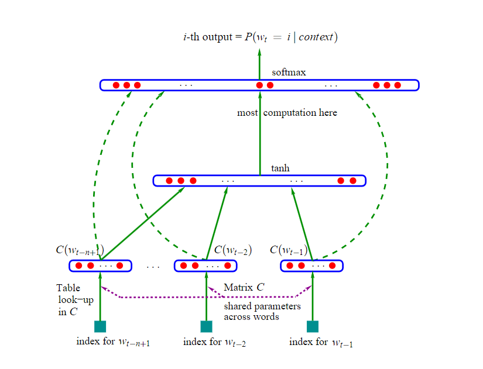
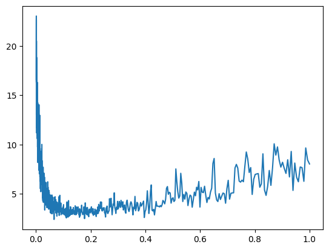
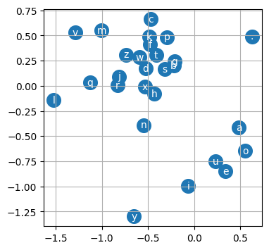
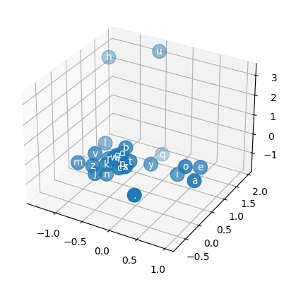

# Multilayer Perceptron (MLP)



MLP, following [Bengio et al. 2003](https://www.jmlr.org/papers/volume3/bengio03a/bengio03a.pdf)

***Table of Contents***
<!-- no toc -->
- [*Usage*](#usage)
- [*Basic Setup*](#basic-setup)
- [*Build MLP*](#build-mlp)
- [*Training*](#training)
- [*Mini-Batch*](#mini-batch)
- [*Learning Rate*](#learning-rate)
- [*Dataset Split*](#dataset-split)
- [*Visualization*](#visualization)
- [*High-Dimensional Space*](#high-dimensional-space)
- [*Summary*](#summary)
- [*Appendix: Broadcasting*](#appendix-broadcasting)

## Usage

The included `names.txt` dataset, as an example, has the most common 32K names taken from [ssa.gov](https://www.ssa.gov/oact/babynames/) for the year 2018. It looks like:

```text
emma
olivia
ava
isabella
sophia
charlotte
...
```

## Basic Setup

First, we build the dataset to train.

```python
import torch
import torch.nn.functional as F
import matplotlib.pyplot as plt
%matplotlib inline

# read all the words in the file
words = open("../names.txt").read().splitlines()

# build the vocabulary of characters and mapping to/from integers
chars = sorted(list(set(''.join(words))))
stoi = { ch: i + 1 for i, ch in enumerate(chars) }
stoi["."] = 0
itos = { i: ch for ch, i in stoi.items() }

# build the dataset
block_size = 3  # context length: how many characters do we take to predict the next one
X, Y = [], []
for w in words:
    
    print(w)
    context = [0] * block_size
    for ch in w + ".":
        ix = stoi[ch]
        X.append(context)
        Y.append(ix)
        # print(''.join([itos[i] for i in context]), '--->', itos[ix])
        context = context[1:] + [ix]    # crop and append
        
X = torch.tensor(X)
Y = torch.tensor(Y)
```

How many samples do we have?

```python
len(words)  # 32033
```

Let's see how we transformed the dataset into features and labels.

```python
block_size = 3  # using contiguous 3 characters to predict the next one
X, Y = [], []
for w in words[:3]:
    print(w)
    context = [0] * block_size
    for ch in w + ".":
        ix = stoi[ch]
        X.append(context)
        Y.append(ix)
        print(''.join([itos[i] for i in context]), '--->', itos[ix])
        context = context[1:] + [ix]    # crop and append
```

```text
emma
... ---> e
..e ---> m
.em ---> m
emm ---> a
mma ---> .
olivia
... ---> o
..o ---> l
.ol ---> i
oli ---> v
liv ---> i
ivi ---> a
via ---> .
ava
... ---> a
..a ---> v
.av ---> a
ava ---> .
```

## Embedding

In this case, we want to embed the features into a 2D space. So, let's do it.

First, generate the embedding matrix.

```python
g = torch.Generator().manual_seed(2147483647)   # consistent with Andrej's settings
C = torch.randn((27, 2), generator=g)
```

Why $27 \times 2$? Because we map 27 characters ('a...z' + '.') to a 2D space.

simply run blow, we get a 3D tensor.

```python
emb = C[X]
emb.shape   # torch.Size([228146, 3, 2])
```

How does `emb = C[X]` work? It's a kind of indexing. When indexing `C` with `X`, we get a 3D tensor. **The first dimension is the same as `X`, and the last two dimensions are the same as `C`.**

For example. The embedding matrix `C` is below:

```text
# C = torch.randn((27, 2), generator=g)
tensor([[ 1.5674, -0.2373],
        [-0.0274, -1.1008],
        [ 0.2859, -0.0296],
        [-1.5471,  0.6049],
        [ 0.0791,  0.9046],
        [-0.4713,  0.7868],
        [-0.3284, -0.4330],
        [ 1.3729,  2.9334],
        [ 1.5618, -1.6261],
        [ 0.6772, -0.8404],
        [ 0.9849, -0.1484],
        [-1.4795,  0.4483],
        [-0.0707,  2.4968],
        [ 2.4448, -0.6701],
        [-1.2199,  0.3031],
        [-1.0725,  0.7276],
        [ 0.0511,  1.3095],
        [-0.8022, -0.8504],
        [-1.8068,  1.2523],
        [ 0.1476, -1.0006],
        [-0.5030, -1.0660],
        [ 0.8480,  2.0275],
        [-0.1158, -1.2078],
        [-1.0406, -1.5367],
        [-0.5132,  0.2961],
        [-1.4904, -0.2838],
        [ 0.2569,  0.2130]])
```

Let's embed `"..e"` manually:

1. `..e` is `[0, 0, 5]` in `X` depending on the `stoi` map.
2. `[0, 0, 5]` to index means `['the first row', 'the first row', 'the 6th row']` in `C`, so we get `[[ 1.5674, -0.2373], [ 1.5674, -0.2373], [ 0.4713,  0.7868]]`.

Now check the result:

```python
emb[1]  # "..e" is the 2nd sample in X
```

```text
tensor([[ 1.5674, -0.2373],
        [ 1.5674, -0.2373],
        [-0.4713,  0.7868]])    # exactly the same as we calculated.
```

Next, we want to flatten the 3D tensor to 2D, so we can use it as input to the MLP. Mapping `(228146, 3, 2)` to `(228146, 6)`. And Andrej gives us three ways to implement it.

```python
# Method 1. Using torch.cat
torch.cat([emb[:, 0, :], emb[:, 1, :], emb[:, 2, :]], dim=1)

# Method 2. Using torch.cat and torch.unbind
torch.cat(torch.unbind(emb, 1), dim=1)

# Method 3. Using view
emb.view(-1, 6)
```

Let's check the equivalence:

```python
emb.view(32, -1) == torch.cat(torch.unbind(emb, 1), dim=1)  
# tensor([[True, True, True, True, True, True], ...]) --> all True means equivalent
```

The `view` is the most concise and efficient. The feasibility of the `view` lies in the Pytorch's internal storage mechanism for tensors. For details, see [PyTorch internals](http://blog.ezyang.com/2019/05/pytorch-internals/).

## Build MLP

Now we have the input to the MLP, let's build it.

```python
# Build the first layer
n_hidden = 100
n_input = 6

W1 = torch.randn((n_input, n_hidden))
b1 = torch.randn((n_hidden,))
h = torch.tanh(emb.view(-1, 6) @ W1 + b1)

# Build the second layer
n_output = 27
W2 = torch.randn((n_hidden, n_output))
b2 = torch.randn((n_output,))
logits = h @ W2 + b2

# Generate the probabilities
counts = logits.exp()
probs = counts / counts.sum(1, keepdim=True)

# Loss function
loss = - probs[torch.arange(X.shape[0]), Y].log().mean()
```

The whole process is the `forward pass` of the MLP.

Here introduce the `cross_entropy` function to generate the loss depending on probabilities.

```python
loss = F.cross_entropy(logits, Y)

# equivalent to
counts = logits.exp()
probs = counts / counts.sum(1, keepdim=True)
loss = - probs[torch.arange(X.shape[0]), Y].log().mean()
```

And according to `backpropagation`, we turn on the `requires_grad` flag for all the parameters. Now we rewrite the parameters initialization and forward pass.

```python
# for reproducibility
g = torch.Generator().manual_seed(2147483647)   # consistent with Andrej's settings 

# setting parameters
n_input = 6             # 3 characters * 2D embedding
n_hidden = 100
n_output = 27

C = torch.randn((27, 2), requires_grad=True, generator=g)
W1 = torch.randn((n_input, n_hidden), requires_grad=True, generator=g)
b1 = torch.randn((n_hidden,), requires_grad=True, generator=g)
W2 = torch.randn((n_hidden, n_output), requires_grad=True, generator=g)
b2 = torch.randn((n_output,), requires_grad=True, generator=g)

parameters = [C, W1, b1, W2, b2]        # collect all parameters

# embedding
emb = C[X]

# forward pass
h = torch.tanh(emb.view(-1, 6) @ W1 + b1)
logits = h @ W2 + b2
loss = F.cross_entropy(logits, Y)
```

## Training

Like before, we need the `embedding` and the `forward pass` to iterate the training process.

```python
# embedding
emb = C[X]

# forward pass
h = torch.tanh(emb.view(-1, 6) @ W1 + b1)
logits = h @ W2 + b2
loss = F.cross_entropy(logits, Y)

# backward pass
for p in parameters:
    p.grad = None
loss.backward()

# update
for p in parameters:
    p.data -= 1.0 * p.grad
```

Let's train the model for 5000 iterations.

```python
for _ in range(5000):

    # embedding
    emb = C[X]

    # forward pass
    h = torch.tanh(emb.view(-1, 6) @ W1 + b1)
    logits = h @ W2 + b2
    loss = F.cross_entropy(logits, Y)
    print(loss.item())  # trace the loss

    # backward pass
    for p in parameters:
        p.grad = None
    loss.backward()

    # update
    for p in parameters:
        p.data -= 1.0 * p.grad
```

The loss is decreasing, meaning the model is learning. Yay~!

```text
19.505229949951172
17.08448028564453
15.776530265808105
14.833340644836426
14.002605438232422
13.253263473510742
12.57991886138916
11.983102798461914
11.470492362976074
11.05185604095459
10.709587097167969
10.407631874084473
10.127808570861816
9.864364624023438
9.614503860473633
9.376439094543457
9.148944854736328
8.931109428405762
8.722230911254883
8.521748542785645
8.329227447509766
8.144325256347656
7.966790676116943
7.796450614929199
7.633184909820557
...
2.436875343322754
2.4368624687194824
2.436849594116211
2.4368364810943604
2.436823844909668
```

Over 5000 iterations, the loss is decreasing from `19.505` to `2.311`. It's good, but we can do much better.

## Mini-Batch

The first optimization is to use `mini-batch` to speed up the training process.

```python
for _ in range(5000):

    # mini-batch construction
    ix = torch.randint(0, X.shape[0], (32,))    # 32 is the batch size

    # embedding
    emb = C[X[ix]]  # randomly select 32 samples

    # forward pass
    h = torch.tanh(emb.view(-1, 6) @ W1 + b1)
    logits = h @ W2 + b2
    loss = F.cross_entropy(logits, Y[ix])   # use the related labels

    # backward pass
    for p in parameters:
        p.grad = None
    loss.backward()

    # update
    for p in parameters:
        p.data -= 0.1 * p.grad
```

The training process becomes much faster, but we need to evaluate the loss on the whole dataset, not just the mini-batch.

```python
# embedding
emb = C[X]

# forward pass
h = torch.tanh(emb.view(-1, 6) @ W1 + b1)
logits = h @ W2 + b2
loss = F.cross_entropy(logits, Y)
print(loss.item())
```

The loss is decreasing from `2.311` to `2.288`, and the training process is much faster. Amazing!

## Learning Rate

The second optimization is to use the `learning rate` to control the update step.

In the previous training process, we choose learning rates `1.0` and `0.1` by experience or guess. This is not a good practice, in other words, it's not an optimal (or ideal) learning rate.

How can we deal with it?

First, visualize the loss with different learning rates.

```python
# generate learning rates from 0.001 to 1.0
lre = torch.linspace(-3., 0., 1000)
lrs = 10**lre

# trace the lr and loss info
lri = []
lossi = []

# mini-batch training
for i in range(1000):

    # mini-batch construction
    ix = torch.randint(0, X.shape[0], (32,))    # 32 is the batch size

    # embedding
    emb = C[X[ix]]  # randomly select 32 samples

    # forward pass
    h = torch.tanh(emb.view(-1, 6) @ W1 + b1)
    logits = h @ W2 + b2
    loss = F.cross_entropy(logits, Y[ix])   # use the related labels
    
    # backward pass
    for p in parameters:
        p.grad = None
    loss.backward()

    # update
    lr = lrs[i]
    for p in parameters:
        p.data -= lr * p.grad

    # trace stats
    lri.append(lr)
    lossi.append(loss.item())

# visualize
plt.plot(lri, lossi)
```

The loss is decreasing with the learning rate increasing, but it's not a linear relationship. The loss is decreasing rapidly at the beginning, and then the decreasing speed is slowing down. The optimal learning rate is around `0.1`.



We can use this learning rate to train the model.

## Dataset Split

In practice, researchers split the dataset into different parts, aiming to avoid overfitting. Generally, we use the `training set` to train the model and the `validation/dev set` to evaluate the hyperparameters. Finally, we test the model on the `test set`.

The proportion of `training`, `dev/validation`, and `test` splits is usually `80%`, `10%`, and `10%`, respectively.

```python
# rebuild the dataset
def build_dataset(words):
    block_size = 3  # using 3 contiguous characters to predict the next one
    X, Y = [], []
    for w in words:
        context = [0] * block_size
        for ch in w + ".":
            ix = stoi[ch]
            X.append(context)
            Y.append(ix)
            context = context[1:] + [ix]    # crop and append
    return torch.tensor(X), torch.tensor(Y)

# split the dataset, randomly
import random

random.seed(2147483647)
random.shuffle(words)

n1 = int(0.8 * len(words))
n2 = int(0.9 * len(words))

Xtrain, Ytrain = build_dataset(words[:n1])
Xdev, Ydev = build_dataset(words[n1:n2])
Xtest, Ytest = build_dataset(words[n2:])
```

Now rewrite the training process with only the `training set`, and use the `validation set` to evaluate.

```python
# mini-batch training
for i in range(10000):

    # mini-batch construction
    ix = torch.randint(0, Xtrain.shape[0], (32,))    # 32 is the batch size

    # embedding
    emb = C[Xtrain[ix]]  # randomly select 32 samples

    # forward pass
    h = torch.tanh(emb.view(-1, 6) @ W1 + b1)
    logits = h @ W2 + b2
    loss = F.cross_entropy(logits, Ytrain[ix])   # use the related labels
    
    # backward pass
    for p in parameters:
        p.grad = None
    loss.backward()

    # update
    lr = 0.1
    for p in parameters:
        p.data -= lr * p.grad
```

After about 100,000 iterations, the loss in the `training set` is `2.324`, compared to `2.348` in the `validation set` and `2.334` in the `test set`. The model is not overfitting.

```python
# dev/validation valuation
emb = C[Xdev]
h = torch.tanh(emb.view(-1, 6) @ W1 + b1)
logits = h @ W2 + b2
loss_dev = F.cross_entropy(logits, Ydev)
print(loss_dev.item())

# test valuation
emb = C[Xtest]
h = torch.tanh(emb.view(-1, 6) @ W1 + b1)
logits = h @ W2 + b2
loss_test = F.cross_entropy(logits, Ytest)
print(loss_test.item())
```

## Visualization

Why do we embed the characters into a 2D space? The answer is visualization. Let's see this 2D embedding space.

```python
# visualize dimensions 0 and 1 of the embedding matrix C for all characters
plt.figure(figsize=(8,8))
plt.scatter(C[:,0].data, C[:,1].data, s=200)
for i in range(C.shape[0]):
    plt.text(C[i,0].item(), C[i,1].item(), itos[i], ha="center", va="center", color='white')
plt.grid('grid')
```



This is how characters are embedded into a 2D space. You can see that the vowels `a`, `e`, `u`, `i`, and `o` are close to each other, which means they can replace each other in the names by higher probability. It is amazing!

Let's map characters into a 3D space.

```python
# mapping to 3D space
C = torch.randn((27, 3))
n_input = 3 * 3     # 3 characters * 3D embedding

# 3D visualization
from mpl_toolkits.mplot3d import Axes3D
fig = plt.figure()
ax = fig.add_subplot(projection='3d')
ax.scatter(C[:,0].data, C[:,1].data, C[:,2].data, s=200)
for i in range(C.shape[0]):
    ax.text(C[i,0].item(), C[i,1].item(), C[i,2].item(), itos[i], ha="center", va="center", color='white')
plt.grid('minor')
```



Although we cannot visualize higher-dimensional spaces, we imagine when the dimension increases, the distance between characters will carry more information, and the model will learn better. Let's try it!

## High-Dimensional Space

The following is a complete code of MLP with 100-dimensional embedding. 

```python
import torch
import torch.nn.functional as F
import matplotlib.pyplot as plt
%matplotlib inline

# read all the words in the file
words = open("../names.txt").read().splitlines()

# build the vocabulary of characters and mapping to/from integers
chars = sorted(list(set(''.join(words))))
stoi = { ch: i + 1 for i, ch in enumerate(chars) }
stoi["."] = 0
itos = { i: ch for ch, i in stoi.items() }

# build the dataset
def build_dataset(words):
    block_size = 3  # using 3 contiguous characters to predict the next one
    X, Y = [], []
    for w in words:
        context = [0] * block_size
        for ch in w + ".":
            ix = stoi[ch]
            X.append(context)
            Y.append(ix)
            context = context[1:] + [ix]    # crop and append
    return torch.tensor(X), torch.tensor(Y)

# split the dataset, randomly
import random

random.seed(2147483647)
random.shuffle(words)

n1 = int(0.8 * len(words))
n2 = int(0.9 * len(words))

Xtrain, Ytrain = build_dataset(words[:n1])
Xdev, Ydev = build_dataset(words[n1:n2])
Xtest, Ytest = build_dataset(words[n2:])

# Let's embed the char to 100D space
# for reproducibility
g = torch.Generator().manual_seed(2147483647)   # consistent with Andrej's settings 

# setting parameters
n_input = 300             # 3 characters * 100D embedding
n_hidden = 200
n_output = 27

C = torch.randn((27, 100), requires_grad=True, generator=g)
W1 = torch.randn((n_input, n_hidden), requires_grad=True, generator=g)
b1 = torch.randn((n_hidden,), requires_grad=True, generator=g)
W2 = torch.randn((n_hidden, n_output), requires_grad=True, generator=g)
b2 = torch.randn((n_output,), requires_grad=True, generator=g)

parameters = [C, W1, b1, W2, b2]        # collect all parameters

# mini-batch training
for i in range(100000):

    # mini-batch construction
    ix = torch.randint(0, Xtrain.shape[0], (32,))    # 32 is the batch size

    # embedding
    emb = C[Xtrain[ix]]  # randomly select 32 samples

    # forward pass
    h = torch.tanh(emb.view(-1, n_input) @ W1 + b1)
    logits = h @ W2 + b2
    loss = F.cross_entropy(logits, Ytrain[ix])   # use the related labels
    
    # backward pass
    for p in parameters:
        p.grad = None
    loss.backward()

    # update
    lr = 0.1
    for p in parameters:
        p.data -= lr * p.grad

print(f"the training's loss {loss.item():.4f}")

# dev/validation valuation
emb = C[Xdev]
h = torch.tanh(emb.view(-1, n_input) @ W1 + b1)
logits = h @ W2 + b2
loss_dev = F.cross_entropy(logits, Ydev)
print(f"the validation's loss {loss_dev.item():.4f}")

# test valuation
emb = C[Xtest]
h = torch.tanh(emb.view(-1, n_input) @ W1 + b1)
logits = h @ W2 + b2
loss_test = F.cross_entropy(logits, Ytest)
print(f"the test's loss {loss_test.item():.4f}")
```

```text
the training's loss 2.7563
the validation's loss 2.2675
the test's loss 2.2619
```

As expected, the model achieves the best performance so far. The loss decreases from `2.288` ( the best result from the 2D ) to `2.2619`.

## Summary

Following Andrej Karpathy's tutorial, we achieved the following results:

|   Method       |Loss Value|
|:---------------|---------:|
| basic          | 2.311    |
| mini-batch     | 2.288    |
| dataset split  | 2.324    |
| 100d embedding | 2.262    |
|                |          |

Highly recommended to watch the [bilibili](https://www.bilibili.com/video/BV1pZ42117RR?vd_source=1441b5bd793a9efda4bf62153bcca888).

## Appendix: Broadcasting

As Andrej Karpathy mentioned, be careful with the `broadcasting`!

Two tensors are “broadcastable” if the following rules hold:

- Each tensor has at least one dimension.

- When iterating over the dimension sizes, starting at the trailing dimension, the dimension sizes must either be equal, one of them is 1, or one of them does not exist.

Excellent examples are given in the official document.

```python
x=torch.empty(5,7,3)
y=torch.empty(5,7,3)
# same shapes are always broadcastable (i.e. the above rules always hold)

x=torch.empty((0,))
y=torch.empty(2,2)
# x and y are not broadcastable, because x does not have at least 1 dimension

x=torch.empty(5,3,4,1)
y=torch.empty(  3,1,1)
# x and y are broadcastable.
# 1st trailing dimension: both have size 1
# 2nd trailing dimension: y has size 1
# 3rd trailing dimension: x size == y size
# 4th trailing dimension: y dimension doesn't exist

x=torch.empty(5,2,4,1)
y=torch.empty(  3,1,1)
# x and y are not broadcastable, because in the 3rd trailing dimension 2 != 3
```

If two tensors `x`, `y` are “broadcastable”, the resulting tensor size is calculated as follows:

- If the number of dimensions of x and y are not equal, prepend 1 to the dimensions of the tensor with fewer dimensions to make them equal length.

- Then, for each dimension size, the resulting dimension size is the max of the sizes of x and y along that dimension.

For details, see [Broadcasting Semantics](https://pytorch.org/docs/stable/notes/broadcasting.html)
